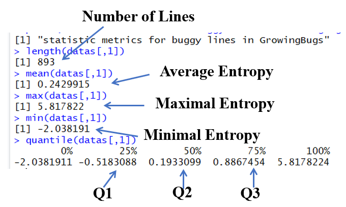
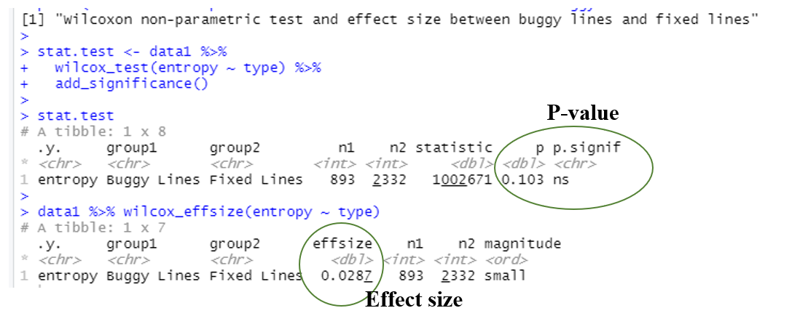

## Replication package for paper "Do Bugs Cause Unnaturalness of Source Code?"

## Content of the replication package

/Tool: The employed tool to generate the entropy of each code line

/Scripts: The implementation (in Java) to replicate the empirical study

/Data: Data to replicate the evaluation in the paper

## How to replicate the empirical study?

### 1 Clone bug repository Defects4J to your local file system

`git clone https://github.com/rjust/defects4j.git` 

### 2 Clone bug repository GrowingBugs to your local file system 

`git clone https://github.com/jiangyanjie/GrowingBugs.git` 

### 3. Clone replication package to your local file system 

`git clone https://github.com/Open4Paper/RevisitingNaturalness.git`

Now you should have tree folders as follows:

### 4. Compute Line Entropy

`cd /Revisiting/RevisitingNaturalness/`

`./calculateEntropy.bat` 

The resulting line entropy is stored in folder `AfterType`. 

### 5. Statistical Analysis

`./analyze.R`

All figures (bean plots) and statistical values should be generated automatically. The following example explains how to identify the statistical values

